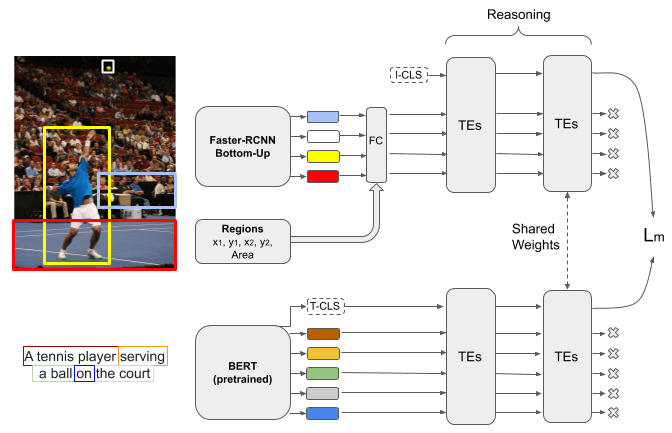

# Transformer Encoder Reasoning Network

Code for the cross-modal visual-linguistic retrieval method from "Transformer Reasoning Network for Image-Text Matching and Retrieval", submitted to ICPR 2020.

This repo is built on top of [VSE++](https://github.com/fartashf/vsepp).
<p align="center">
  
</p>


## Setup

1. Clone the repo and move into it:
```
git clone https://github.com/mesnico/TERN
cd TERN
```

2. Setup python environment using conda:
```
conda env create --file environment.yml
conda activate tern
export PYTHONPATH=.
```

## Get the data
1. Download and extract the data folder, containing COCO annotations, the splits by Karpathy et al. and ROUGEL - SPICE precomputed relevances:

```
wget http://datino.isti.cnr.it/tern/data.tar
tar -xvf data.tar
```

2. Download the bottom-up features. We rearranged the ones provided by [Anderson et al.](https://github.com/peteanderson80/bottom-up-attention) in multiple .npy files, one for every image in the COCO dataset. This is beneficial during the dataloading phase.
The following command extracts them under `data/coco/`. If you prefer another location, be sure to adjust the configuration file accordingly.
```
wget http://datino.isti.cnr.it/tern/features_36.tar
tar -xvf features_36.tar -C data/coco
```

## Evaluate
Download our pre-trained TERN model [here](http://datino.isti.cnr.it/tern/model_best_ndcg.pth)

Then issue the following commands for evaluating the model on the 1k (5fold cross-validation) or 5k test sets.
```
python3 test.py path/to/model_best_ndcg.pth.tar --config configs/tern.yaml --size 1k
python3 test.py path/to/model_best_ndcg.pth.tar --config configs/tern.yaml --size 5k
```

## Train
In order to train the model using the basic TERN configuration, issue the following command:
```
python3 train.py --config configs/tern.yaml --logger_name runs/tern
```
`runs/tern` is where the output files (tensorboard logs, checkpoints) will be stored during this training session.
